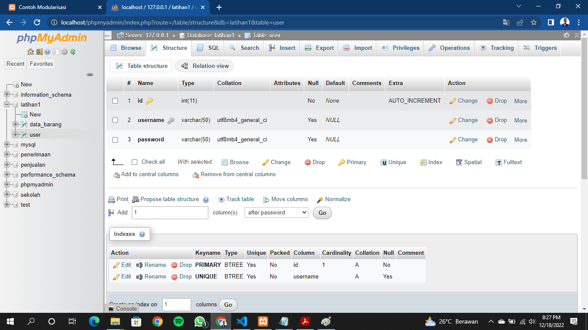
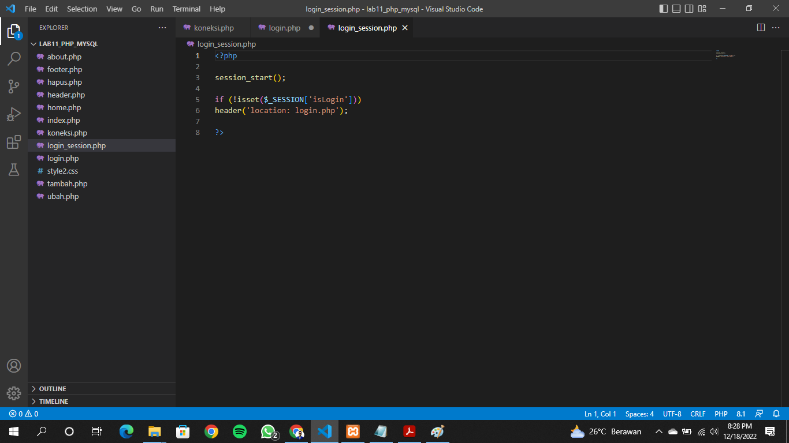
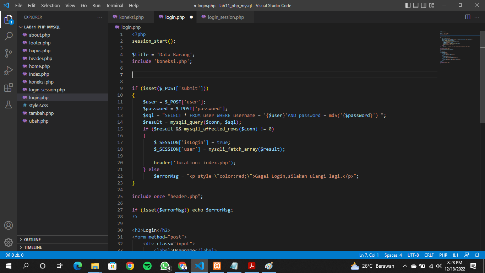
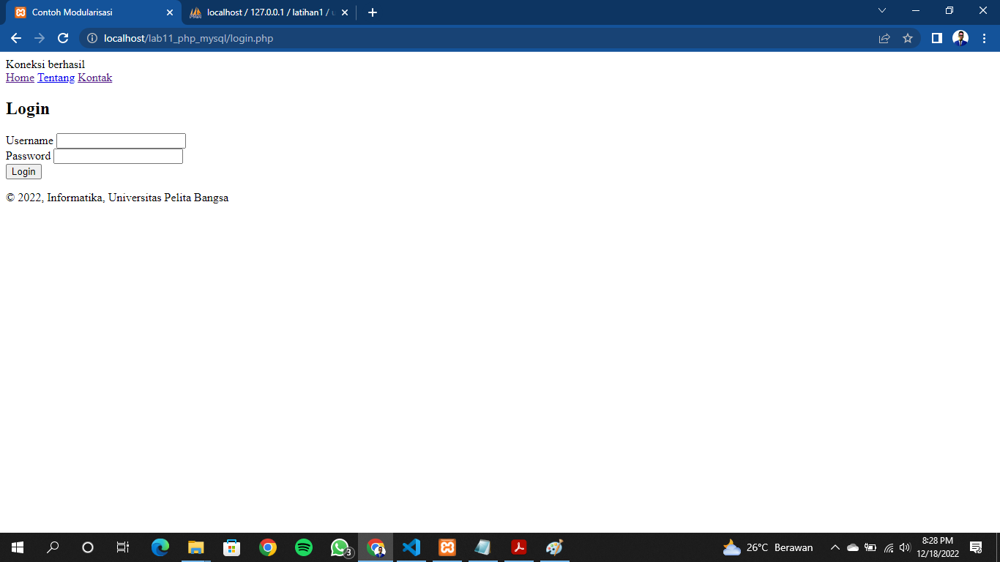

# Lab11Web
## Studi Kasus: Login Form
### DDL: Table user
Buat table seperti ini

### File: login_session.php
Deskripsi: dignakan untuk pengecekan sesi login, file ini nantinya akan di include di
setiap halaman yang membutuhkan login.

### File: login.php

Jadinya akan seperti ini hasilnya
